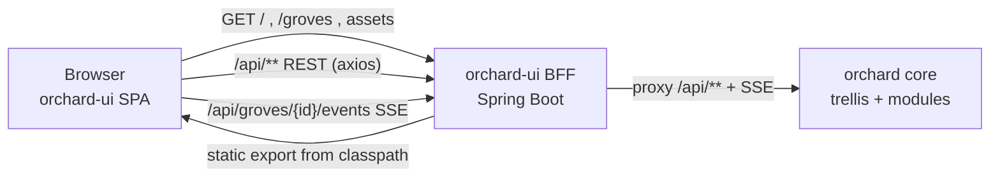

# BFF Architecture — Spring Boot Backend-for-Frontend for orchard-ui

This document describes the architecture of the orchard-ui **Backend-for-Frontend (BFF)**: a
Spring Boot service that lives in the `orchard-ui` repository, serves the static Next.js export,
and reverse-proxies API traffic to orchard core. It is the single process the orchard dev-server
runs to integrate the UI — replacing the static-tarball-embedded-into-`trellis` model.

For the orchard platform's module layout and client-server flows, see
[orchard `docs/architecture/platform-architecture.md`](https://github.com/orchard-cde/orchard/blob/main/docs/architecture/platform-architecture.md).

**Terminology:**

| Term | Meaning |
|------|---------|
| **BFF** | Backend-for-Frontend — a backend tier dedicated to a single frontend, here serving the UI and fronting its API calls |
| **orchard core** | The orchard backend (the `trellis` Spring Boot app and its modules) exposing `/api/**` and the SSE event stream |
| **static export** | The Next.js `next build` output in `out/` — plain HTML/JS/CSS, no Node runtime |
| **SPA fallback** | Routing rule that forwards unmatched client-side routes to `/index.html` so the React router can handle them |

---

## 1. Motivation

The UI currently ships as a static-export tarball (a GitHub Release; see
[release v0.1.0](https://github.com/orchard-cde/orchard-ui/releases/tag/v0.1.0)).
Integrating it into the orchard dev-server (orchard issue #78) requires `trellis` to download the
tarball, unpack it into its static resources, add a SPA-fallback controller, hold a read token for
the private repo, and embed the assets into its GraalVM native image. That is a non-trivial amount
of UI-serving machinery living inside the core backend, coupled across two repositories.

A BFF inverts the ownership: the UI repository owns its own serving layer. The dev-server's job
shrinks from *"build UI → fetch tarball → unpack → embed → serve"* to *"run this service, point it
at core."* The UI stays a separately-deployed concern, and orchard core stops carrying frontend
responsibilities.

Spring Boot — rather than nginx, Caddy, or a Node server — is the chosen runtime for two reasons:

1. **Stack consistency.** orchard core is Spring Boot 4.x on Java 25 (GraalVM CE) with GraalVM
   native-image builds. The BFF reuses that toolchain, idioms, and native-binary packaging rather
   than introducing a second ecosystem.
2. **Room to grow.** orchard core is an OAuth2 resource server. Today the browser is responsible
   for credentials. A Spring Boot BFF is the natural place to later terminate a session cookie and
   relay tokens to core (the canonical "BFF security pattern"), or to aggregate/reshape core
   responses — without re-platforming. See [§7](#7-growth-path).

The BFF's job **today** is deliberately thin: serve static + proxy. The Spring Boot choice is an
investment in that growth path and stack consistency, made with eyes open that a pure serve+proxy
needs less.

---

## 2. Topology

The BFF is the single origin the browser talks to. Same-origin serving means the UI keeps emitting
relative `/api/**` URLs and there is no CORS — preserving the existing
`NEXT_PUBLIC_API_URL=''` contract verbatim.



| Path | Handled by | Behavior |
|------|-----------|----------|
| `/`, `/groves`, `/nursery`, … (client routes) | BFF | Serve `index.html` (SPA fallback) |
| `/_next/**`, `/favicon.ico`, static assets | BFF | Serve from embedded static resources |
| `/api/**` | BFF → core | Reverse-proxy, headers + status passed through transparently |
| `/api/groves/{id}/events` | BFF → core | Reverse-proxy as a **streamed** `text/event-stream` (SSE) |

---

## 3. Component placement and build

orchard-ui is a Gradle **multi-project**; the BFF is the `:backend` module, alongside the
`:frontend` module (the Next.js app). A single `./gradlew` at the repo root drives both.

```
orchard-ui/
  settings.gradle.kts                      # include(":frontend", ":backend")
  build.gradle.kts  gradle.properties      # root: shared config + canonical version
  gradlew, gradle/                         # Gradle wrapper (repo root)
  frontend/                                # :frontend — Next.js app + node build wrapper
    build.gradle.kts                       #   npm ci + `next build` → frontend/out (cached)
    app/ components/ lib/ types/  package.json  next.config.ts
  backend/                                 # :backend — Spring Boot 4.x, Java 25 GraalVM
    build.gradle.kts
    src/main/java/dev/orchard/ui/backend/  # package dev.orchard.ui.backend
    src/main/resources/application.yml
```

**Build integration.** `:backend` declares a real Gradle dependency on `:frontend`'s build output:

1. `:frontend`'s Gradle build runs the Node build (`npm ci` + `next build`) with declared
   inputs/outputs, producing `frontend/out` — cached, so `next build` only re-runs when frontend
   sources change.
2. `:backend`'s `processResources` consumes that output through the inter-module dependency and
   stages it under `static/` on the runtime classpath — no hardcoded paths.
3. `./gradlew :backend:bootJar` (or `nativeCompile`) produces one self-contained artifact with the
   UI embedded — the native binary `orchard-ui-backend`.

Because the dependency is wired through Gradle, every backend task that needs the UI (`bootJar`,
`nativeCompile`, `bootRun`, and tests) builds the cached frontend first. `:backend`'s Spring Boot,
dependency-management, and GraalVM native-image plugin versions track orchard core.

> **Decision — Gradle multi-project (`:frontend` + `:backend`).** One root build with two modules
> gives a single `./gradlew` entrypoint and a real producer/consumer dependency (the backend
> consumes the frontend's output), so the UI embed is correct and cached without hardcoded paths,
> while each toolchain stays idiomatic inside its module. (This supersedes the earlier
> `bff/`-standalone-subdirectory layout.)

---

## 4. Request routing and the proxy

The proxy must satisfy two transport shapes the UI actually uses:

- **REST** via axios on `/api/**`, carrying an `X-Cultivator-Id` request header, with a `401`
  response driving a client-side redirect to `/unauthorized`. The proxy must pass request headers
  and response status through transparently.
- **Server-Sent Events** via `EventSource` on `/api/groves/{id}/events`
  (`text/event-stream`, long-lived). The proxy must **stream** the response — a buffer-and-forward
  proxy breaks SSE.

> **Decision — hand-rolled servlet streaming proxy (primary); Spring Cloud Gateway Server WebMVC
> (documented alternative).** Because the BFF ships as a GraalVM **native binary** (see
> [§3](#3-component-placement-and-build)), native-image cleanliness is the deciding criterion. The
> primary proxy is a catch-all `@RequestMapping("/api/**")` controller using `RestClient` whose
> upstream response `InputStream` is piped into a `StreamingResponseBody` — it preserves SSE
> streaming, passes request headers (incl. `X-Cultivator-Id`) and response status through, and is
> trivially native-image friendly (no reflection-heavy machinery). The servlet variant of Spring
> Cloud Gateway (`spring-cloud-starter-gateway-server-webmvc`, BOM `2025.1.2`, which supports
> Spring Boot 4.1.0) is a viable alternative — it gives SSE streaming and header/status passthrough
> by default — but it is reflection-heavy and needs native reachability metadata, so it is held in
> reserve, not the default. A naive buffered `RestClient`/`RestTemplate` proxy is explicitly
> rejected because it breaks SSE.

No WebSocket proxying is required today: the UI uses SSE, not WebSocket, for grove events. (orchard
core pulls in the websocket starter for other reasons, but the UI does not open a WS connection.)
WebSocket passthrough is a future concern, noted in [§7](#7-growth-path).

---

## 5. SPA fallback and static serving

The BFF serves the embedded static export through a `PathResourceResolver` ported from trellis's
`SpaResourceConfig`. Naive "forward everything to `/index.html`" is **wrong** for this export: the
root `out/index.html` is a Next.js *error* shell (`__next_error__`), so serving it for deep links
breaks them — the exact bug issue #9 calls out. Instead the resolver resolves each request in order:

1. `api`, `actuator`, `ws` prefixes → `null` (404) — never given the SPA shell.
2. A path with a file extension (`/_next/...`, `/favicon.ico`) → the real asset, or 404 if missing.
3. An extensionless route → the prerendered `<route>/index.html` (e.g. `groves/index.html`).
4. Else the dynamic-route placeholder `<parent>/_/index.html` (e.g. `groves/_/index.html` for
   `/groves/{uuid}`, emitted by the UI's `generateStaticParams` `_` sentinel).
5. Else the root `index.html` shell as a last resort.

An extensionless route is **never** served as a raw directory resource — in the native image,
classpath directories report `isReadable()==true` and would otherwise be served as
`application/octet-stream`. This is the same routing knowledge the deferred `trellis`
`SpaResourceConfig` carried; co-locating it with the UI build (in this repo) is the point of issue
#9 — core never learns about UI routes, and the Next-static-export specifics live next to the UI.

---

## 6. Configuration and dev workflow

**Configuration.** The BFF needs exactly one piece of wiring to find core:

| Property | Purpose | Default / source |
|----------|---------|------------------|
| `orchard.core.base-url` | Upstream base URL for `/api/**` proxying | Environment-overridable (e.g. `http://localhost:8080` in dev) |

The UI build continues to set `NEXT_PUBLIC_API_URL=''` so the browser emits relative `/api/**`
URLs; the BFF resolves them to `orchard.core.base-url`. The `??`-not-`||` env handling in
`apiClient.ts` and `useGroveEvents.ts` remains load-bearing.

**Dev workflow** is profile-gated so hot-module-reload survives:

| Mode | Static / UI routes | `/api/**` | Processes running |
|------|--------------------|-----------|-------------------|
| `dev` profile | Proxy to `next dev` (`:3000`) for HMR | Proxy to core | postgres + core + BFF + `next dev` |
| packaged (default) | Serve embedded static export + SPA fallback | Proxy to core | postgres + core + BFF |

In packaged mode there is no Node runtime — the UI is baked into the BFF artifact.

---

## 7. Growth path

The BFF is built as a seam, not just a proxy. Future capabilities slot in without re-platforming:

- **Session/auth relay (BFF security pattern).** Because core is an OAuth2 resource server, the BFF
  can later terminate a browser session cookie, hold tokens server-side, and attach the bearer
  token to proxied `/api/**` calls — so the browser stops holding JWTs. This is the primary reason
  Spring Boot was chosen over a static file server.
- **Response aggregation.** BFF-owned endpoints can aggregate or reshape multiple core calls into
  UI-shaped payloads, hiding internal service structure.
- **WebSocket passthrough.** If the UI adopts WebSocket (beyond today's SSE), the proxy layer gains
  WS support — straightforward with Spring Cloud Gateway.

These are explicitly **not** built in the initial cut; they are the justification for the runtime
choice, realized later.

---

## 8. What this supersedes

| Previously planned (orchard issue #78, trellis-embed) | Under the BFF |
|-------------------------------------------------------|---------------|
| Gradle `Download` + `Copy` tasks in `trellis` to fetch/unpack the UI tarball | Gone — UI is embedded in the BFF |
| `SpaFallbackController` in `trellis` | Moved into the BFF |
| `UI_BUNDLE_TOKEN` read-token secret on the orchard repo | Gone — no cross-repo tarball fetch |
| `-H:IncludeResources=static/.*` GraalVM arg on `trellis` | Gone — assets live in the BFF image |

The existing **v0.1.0 static-tarball release remains valid and unchanged** — this design does not
touch the release workflow. The BFF simply consumes the same `out/` locally. Whether the UI's
*published* artifact eventually becomes a BFF jar or container (retiring the tarball) is an open
packaging question, deferred — see [§9](#9-out-of-scope--open-questions).

---

## 9. Out of scope / open questions

| Item | Status | Notes |
|------|--------|-------|
| Distribution format | **Decided: GraalVM native binary** (`orchard-ui-backend`) | The `:backend` module builds a standalone native binary, independently deployable and consumed by orchard `dev-server start` (download + spawn as a sibling to `orchard-server`). **Published per architecture (linux/amd64 + linux/arm64) as the release artifact; the static-export tarball is retired.** |
| Actual auth/session/token-relay implementation | Deferred | The seam is built; the logic is future work (see §7) |
| WebSocket proxying | Not needed today | UI uses SSE; revisit if WS is adopted |
| Spring Cloud Gateway ↔ Spring Boot 4.x compatibility | Must verify | Determines primary vs. fallback proxy (see §4) |

---

## References

- [orchard-ui v0.1.0 release](https://github.com/orchard-cde/orchard-ui/releases/tag/v0.1.0) — the static-export tarball/contract this builds on
- orchard issue #78 — dev-server integration (this design supersedes its trellis-embed approach)
- [orchard platform architecture](https://github.com/orchard-cde/orchard/blob/main/docs/architecture/platform-architecture.md) — module layout and client-server flows
